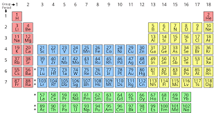

# Spell-With-Elements

This is motived by an interview question I have had. The aim is to take any English word and output whether that word can be spelled out using the chemical symbols from the periodic table.

[Image from Wikipedia](https://www.google.com/imgres?imgurl=https%3A%2F%2Fupload.wikimedia.org%2Fwikipedia%2Fcommons%2Fthumb%2F0%2F03%2FSimple_Periodic_Table_Chart-blocks.svg%2F1200px-Simple_Periodic_Table_Chart-blocks.svg.png&imgrefurl=https%3A%2F%2Fen.wikipedia.org%2Fwiki%2FPeriodic_table&tbnid=loYbdgpOiFIO7M&vet=12ahUKEwiYlNjTo5fxAhXTIhoKHd-bAa0QMygAegUIARDzAQ..i&docid=09cCjaH0MxNCvM&w=1200&h=635&itg=1&q=periodic%20table&client=safari&ved=2ahUKEwiYlNjTo5fxAhXTIhoKHd-bAa0QMygAegUIARDzAQ)

## Example

If the input word is "LION"; the output should be LiON - spelt using the chemical symbols for Lithium, Oxygen and Nitrogen.

## Challenge

The biggest challenge with this problem is some parts of a word could be spelled with different combinations of periodic symbols. Take, the word 'SUPERCALIFRAGILISTIC' (even though the sound of it is something quite atrocious.... sorry), depending on the procedure you follow, you could get to the point where you have "SUPErCAlIFRa" with the remaining portion of the original word being "gilistic". Here you find that there are not any chemical symbols in the periodic table that are 'G' or 'Gi' therefore this 'branch' of the process does not yield a solution so you need to **back-track**. If you adjust the last couple of element symbols you can get the branch "SUPErCAlIFr" which then allows the next symbol to be 'Ag' (symbol for Silver) and therefore yields the solution "SUPErCAlIFrAgILiSTiC".

## Solution

A convenient way to perform this back-tracking enabled algorithm is with recursion. That way if the algorithm goes down a branch and hits a problem it can back up and try another branch until a solution is found or all options are exhausted, in which case a solution can be deemed impossible. This is also known as a 'depth-first search' algorithm.

It can also be noted that the way I have implemented this algorithm will yield the solution that prioritises shorter chemical symbols and thus more individual chemical symbols for each word. An alternative could be priorising using fewer chemical symbols to spell the word.
